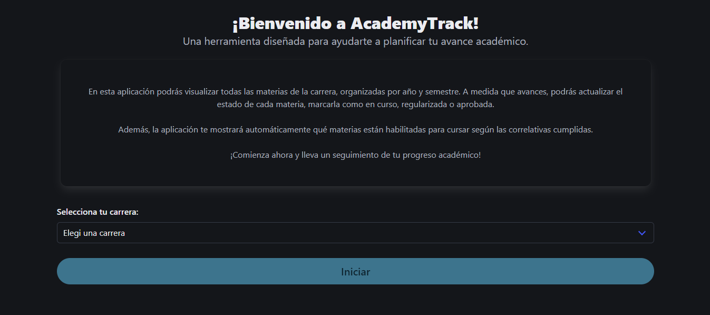
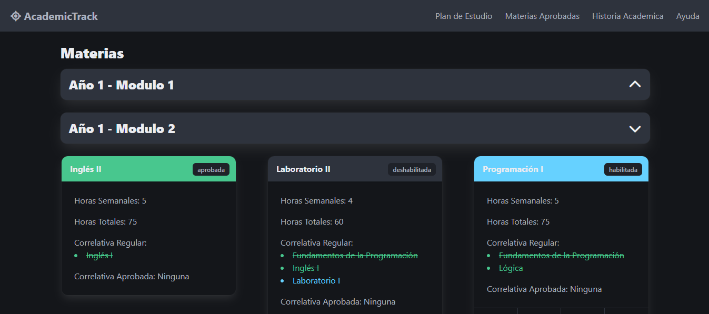
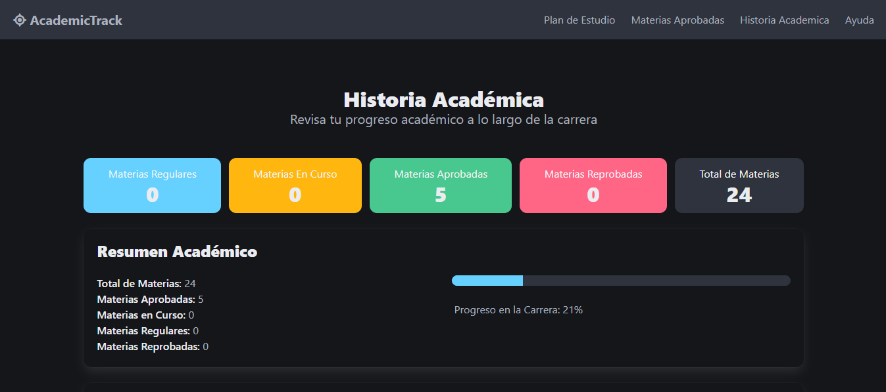

# Academy Track



Academy Track es una aplicación web desarrollada en Angular que permite a los estudiantes universitarios gestionar y visualizar el avance de sus materias a lo largo de su carrera. La aplicación ofrece una vista dinámica y organizada de las materias, agrupadas por año y módulo, e incluye funcionalidades que facilitan el seguimiento del progreso académico.

## Tabla de Contenidos

- [Características](#características)
- [Tecnologías Utilizadas](#tecnologías-utilizadas)
- [Instalación](#instalación)
- [Uso](#uso)
- [Capturas de Pantalla](#capturas-de-pantalla)
- [Contribuciones](#contribuciones)

## Características

- **Visualización Dinámica:** Las materias se agrupan por año y módulo, mostrando su estado de manera clara e interactiva.
- **Gestión de Materias:** Cambia el estado de una materia entre "Aprobada", "Regularizada", "En curso" y "Deshabilitada".
- **Manejo de Correlativas:** Controla las correlativas para habilitar o deshabilitar materias según el progreso del estudiante.
- **Almacenamiento Local:** Utiliza LocalStorage para guardar el estado de las materias, permitiendo persistencia de los datos.
- **Interfaz Intuitiva:** Diseño responsive utilizando Bulma que facilita la navegación en diferentes dispositivos.

## Tecnologías Utilizadas

- **Angular:** Framework de desarrollo frontend.
- **TypeScript:** Lenguaje de programación utilizado para el desarrollo de la lógica.
- **Bulma:** Framework CSS para el diseño y la estructura visual.
- **LocalStorage:** Almacenamiento de datos en el navegador para persistencia.

## Instalación

1. Clona el repositorio:

   ```bash
   git clone https://github.com/lucas29951/academy-track.git

2. Navega al directorio del proyecto:

   ```bash
   cd academy-track

3. Instala las dependencias:

   ```bash
   npm install

4. Inicia la aplicación:

   ```bash
   ng serve

5. Abre el navegador y accede a `http://localhost:4200`.

## Uso

1. Al iniciar la aplicación por primera vez, se verifica si los datos de las materias están en LocalStorage. Si no están, se muestra un botón de inicio para cargarlos.

2. La vista principal muestra las materias agrupadas por año y módulo, permitiendo al usuario interactuar con cada una para cambiar su estado.

3. El header contiene opciones como `Aprobadas`, `Historia Académica`, y `Ayuda/Guía`, facilitando la navegación y el acceso a la información.

## Capturas de Pantalla


_Vista de las materias agrupadas por año y módulo._


_Vista resumen de la Historia Academica del alumno._

## Contribuciones

Las contribuciones son bienvenidas. Si deseas mejorar este proyecto, sigue los siguientes pasos:

1. Haz un fork del repositorio.
2. Crea una nueva rama `(git checkout -b feature/nueva-funcionalidad)`.
3. Realiza tus cambios y haz commit `(git commit -m 'Añadir nueva funcionalidad')`.
4. Sube los cambios a tu fork `(git push origin feature/nueva-funcionalidad)`.
5. Abre un _`Pull Request`_ en este repositorio.
